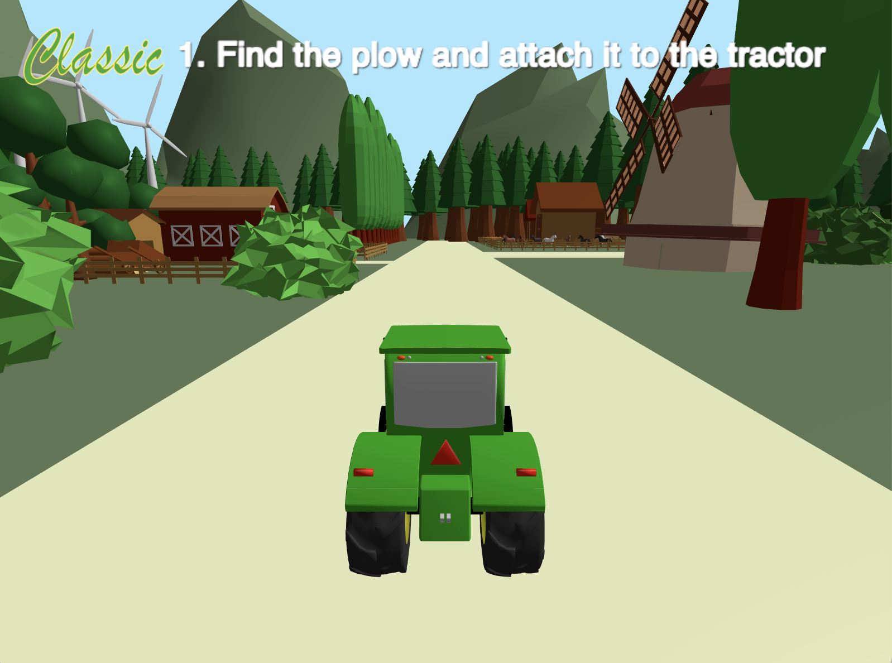
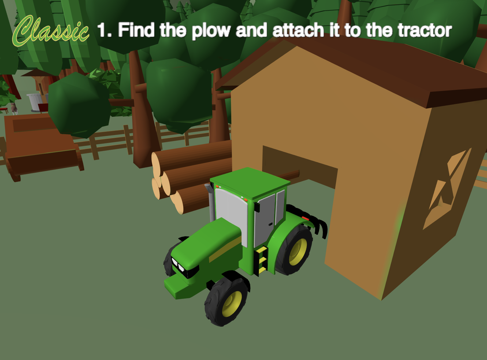
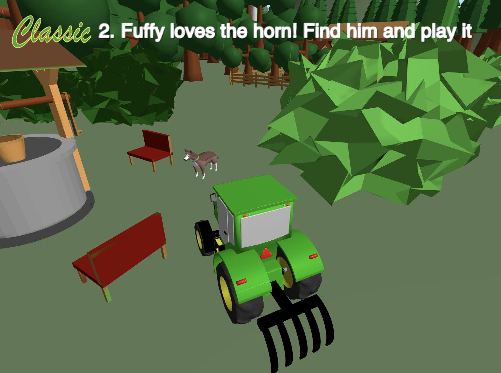
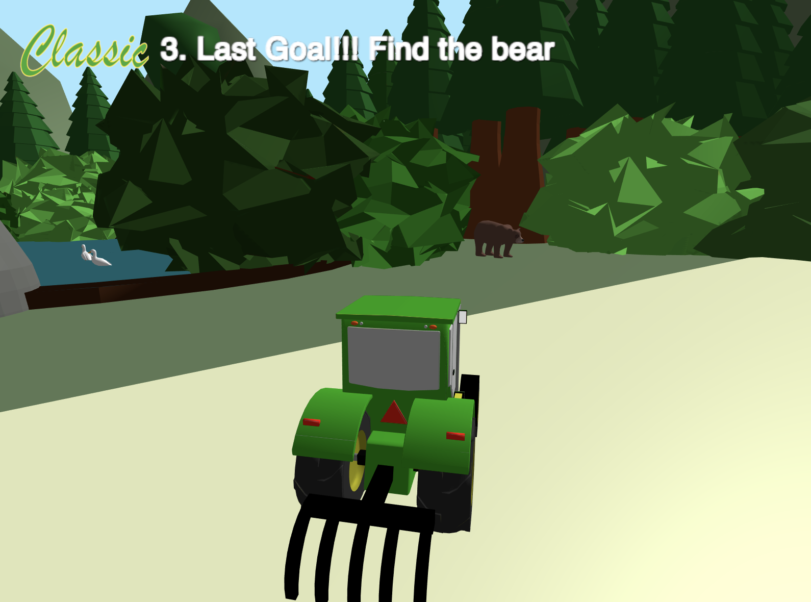
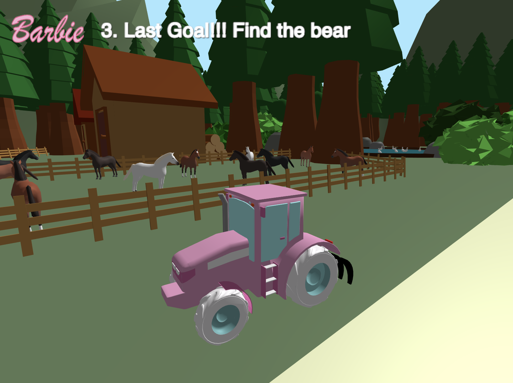

# Computer Graphics Project
Project of the Computer Graphics course at Politecnico di Milano. Final evaluation: 28/30

## Description
Third person simulator in which the user controls a tractor performing precise movement in a country environment in order to reach goals.

## Developers
[Giovanni Pachera](https://github.com/giovannipachera) 
[Ilaria Paddeu](https://github.com/ilariapaddeu)
